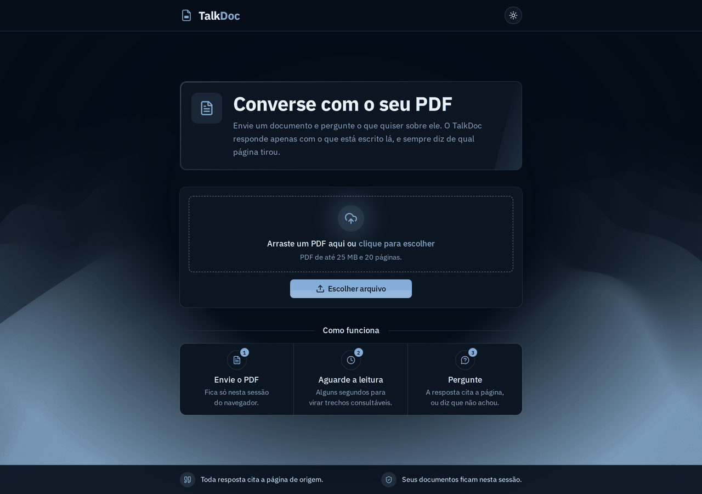
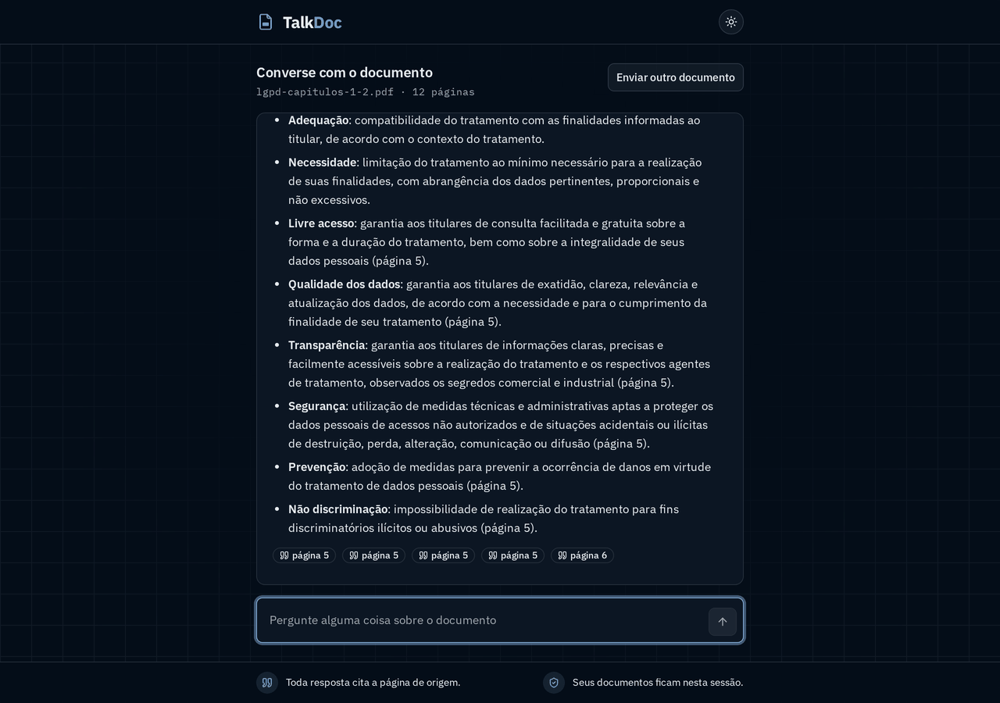
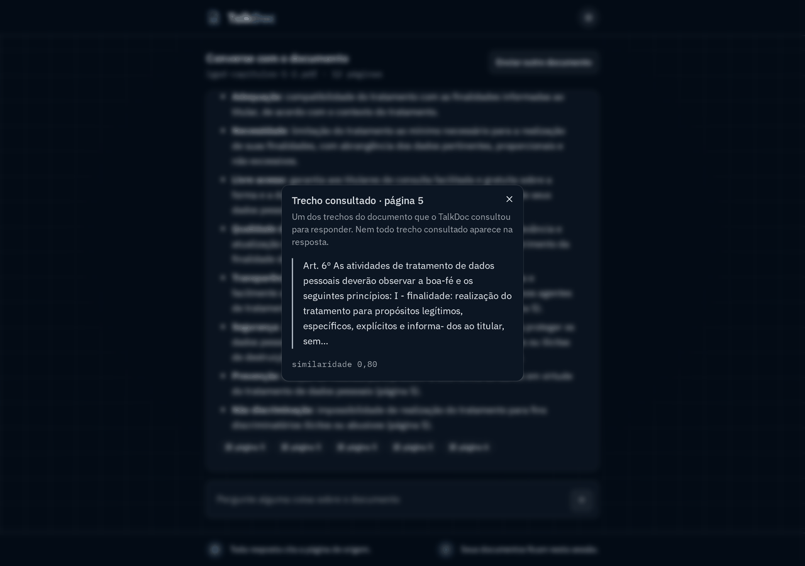
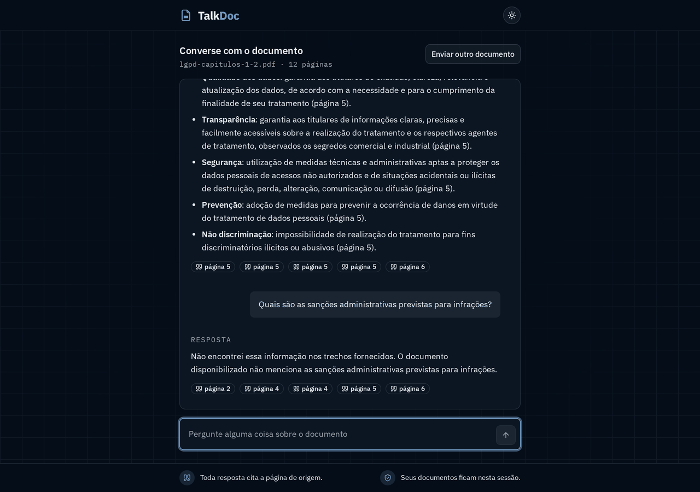
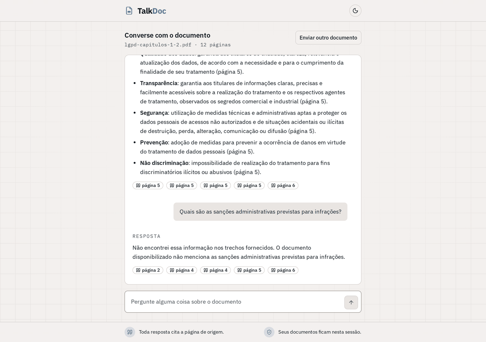
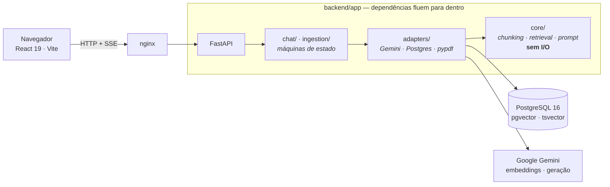
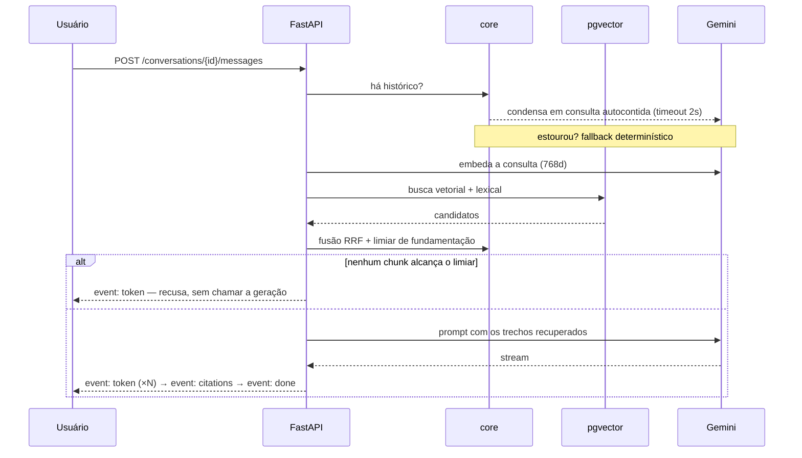

<div align="center">

# TalkDoc

**Envie um PDF e converse com ele.** Toda resposta cita a página de onde saiu —
e quando a resposta não está no documento, o TalkDoc diz isso em vez de inventar.




</div>

---

## O problema, e o que este projeto faz com ele

Um chat sobre documentos é fácil de fazer parecer que funciona. O difícil é
responder duas perguntas que o usuário faz sozinho, em silêncio, toda vez:

1. **"De onde você tirou isso?"** — aqui, toda afirmação vem com o número da
   página, e o trecho exato que a sustentou fica a um clique.
2. **"E se não estiver aí?"** — aqui, a recusa é um caminho de primeira classe,
   medido e calibrado. Um RAG que sempre responde é um RAG que inventa.

O pipeline de RAG é **próprio** — chunking, embeddings, retrieval, fusão e
montagem de prompt escritos no projeto, sem LangChain nem LlamaIndex. Não por
purismo: é o objeto do trabalho, e terceirizá-lo apagaria toda decisão que este
README explica. Há [contrato de arquitetura](backend/.importlinter) que reprova o
build se um framework de RAG entrar pela porta dos fundos.

---

## Rodando em dois comandos

Pré-requisitos: Docker e Docker Compose.

```bash
cp .env.example .env      # preencha GEMINI_API_KEY — a chave gratuita serve
docker compose up --build
```

- Interface: <http://localhost:5173>
- API: <http://localhost:8000> — documentação interativa em `/docs`

Não há passo 3. Um clone limpo sobe os três serviços (nginx com o build estático,
FastAPI e PostgreSQL com pgvector), aplica o schema e fica pronto para uso.

**Para testar sem procurar um PDF:** [`samples/lgpd-capitulos-1-2.pdf`](samples/)
já está no repositório — os Capítulos I e II da LGPD, 12 páginas, domínio público.
É o mesmo documento sobre o qual as métricas abaixo foram medidas, então dá para
conferir cada número com o PDF aberto ao lado.

<details>
<summary><b>Modo de desenvolvimento (HMR + reload)</b></summary>

`docker compose up --build` serve o build estático pelo nginx — é o que se
entrega, e uma alteração no código só aparece depois de reconstruir a imagem.
Para iterar:

```bash
make dev
```

O código do host é montado nos containers: Vite com HMR no frontend, uvicorn com
`--reload` no backend, nas mesmas portas. Os dois modos disputam a 5173 — pare um
antes de subir o outro.

</details>

---

## Como é usar

<table>
<tr>
<td width="50%"></td>
<td width="50%"></td>
</tr>
<tr>
<td><b>A resposta chega em streaming</b>, token a token, e fecha com um chip por
trecho consultado. Cada chip é a página de origem.</td>
<td><b>O chip abre o trecho literal</b> que sustentou aquela parte, com a página e
a similaridade medida. É a auditoria da resposta, não um enfeite.</td>
</tr>
<tr>
<td></td>
<td></td>
</tr>
<tr>
<td><b>Pergunta que o documento não responde recebe recusa</b>, não uma resposta
plausível. Aqui, sanções administrativas — que moram em outro capítulo da lei.</td>
<td><b>Dois temas, e a conversa sobrevive ao F5.</b> Recarregar no meio do
streaming reabre a conversa com a resposta parcial já gravada.</td>
</tr>
</table>

---

## Seis decisões que definem este projeto

### 1. Nenhum chunk atravessa a fronteira de página

A janela de chunking **reseta a cada página**. É isso que torna a citação exata
*por construção*: o `page_number` de um chunk é a página de onde cada caractere
saiu, sem heurística de "de qual página este trecho provavelmente veio". Um único
chunk que cruzasse a fronteira já bastaria para a interface apontar a página
errada — e uma citação errada é pior que citação nenhuma, porque parece
verificada.

### 2. A recusa é medida, e tem duas camadas

O `SIMILARITY_THRESHOLD` é a única defesa contra o modelo responder com base nos
"cinco chunks menos ruins". O valor **não é chutado**: sai de `make eval`, que
mede a distribuição de similaridade de 19 perguntas que o documento responde
contra 6 que ele não responde.

A medição mostrou o limite real da ideia. Entre as negativas, as três que usam o
vocabulário da própria lei — sanções, incidente de segurança, decisão
automatizada — pontuam até **0,668**, e a positiva mais fraca fica em **0,669**.
Um milésimo. **Nenhum limiar separa as duas famílias**, e forçar isso custaria
recusar uma pergunta legítima.

Daí as duas camadas, com trabalhos diferentes:

| camada | pega o quê | custo |
|---|---|---|
| limiar de similaridade | pergunta de **outro assunto** | zero — recusa antes de chamar o modelo |
| instrução de fundamentação no prompt | pergunta do **mesmo assunto** cuja resposta não está nos trechos | uma geração |

Verificado ponta a ponta contra a API real: as três negativas que passam pelo
limiar são recusadas pela segunda camada. Recusa total **6 de 6**.
[Distribuição completa, com as tabelas.](backend/eval/README.md)

### 3. Busca híbrida, porque o vetor borra termo exato

A busca densa coloca um e-mail, um número de artigo ou um nome próprio a
milésimos de distância de qualquer outro trecho do mesmo assunto. A busca lexical
do Postgres (`tsvector` com a configuração `portuguese`, coluna `GENERATED ALWAYS
AS … STORED`) casa o token exato. As duas listas entram numa **fusão RRF**.

O honesto: no dataset de avaliação o delta da fusão foi **zero**. O ganho aparece
em consulta por termo literal — um endereço de e-mail que não figurava no top-3
denso subiu para a 2ª posição. As duas medições estão registradas, inclusive a
que deu zero.

### 4. Pergunta de continuação é reescrita antes da busca

*"E quanto a isso?"* não embeda perto de nada. Antes da busca, a pergunta é
condensada em uma consulta autocontida usando o histórico. Se o provedor não
responder em 2 segundos, entra um **fallback determinístico** — a pergunta
anterior concatenada com a atual — que restaura o referente sem custo, sem
latência e sem erro visível.

Medido: das três continuações do dataset, duas sobem da 2ª para a 1ª posição
quando condensadas.

### 5. O núcleo não conhece I/O, e isso é um gate

`core/` não pode importar FastAPI, asyncpg, o SDK do Google, pypdf, structlog nem
pydantic — nem diretamente, nem por caminho indireto. São **quatro contratos** de
`import-linter` rodando em `make arch`, e `tests/test_architecture.py` injeta um
módulo violador para provar que os contratos mordem. Contrato que nunca reprovou
não é contrato; é comentário.

### 6. Erro é contrato, não acidente

Toda resposta de erro sai como `{code, message}` e o frontend mapeia por `code`,
nunca por status HTTP. Os logs são JSON estruturado com `request_id`, e **nenhum
segredo ou conteúdo de documento entra neles** — há teste que faz `grep` pela
chave na linha renderizada, traceback incluído.

---

## Arquitetura



O fluxo de uma pergunta, do clique à citação:



### Por dentro do backend

| camada | responsabilidade |
|---|---|
| `api/` | recebe HTTP e SSE, valida entrada, traduz exceção em envelope de erro |
| `chat/` · `ingestion/` | máquinas de estado do turno e do documento — irmãs, não podem se importar |
| `adapters/` | Gemini, PostgreSQL (SQL escrito à mão, parametrizado) e extração de PDF |
| `core/` | chunking, retrieval, fusão e montagem de prompt. Funções puras, sem I/O |

### API

| método | rota | o que faz |
|---|---|---|
| `GET` | `/api/health` | estado do serviço e do banco |
| `GET` | `/api/config` | limites de upload que a interface aplica |
| `POST` | `/api/documents` | recebe o PDF, responde `202` e processa em background |
| `GET` | `/api/documents/{id}` | status da ingestão, com progresso por chunk |
| `POST` | `/api/conversations` | abre conversa sobre um documento `ready` |
| `POST` | `/api/conversations/{id}/messages` | responde em **SSE**: `token` → `citations` → `done` (ou `error`) |
| `GET` | `/api/conversations/{id}/messages` | histórico, para a conversa sobreviver ao F5 |

---

## Qualidade, medida

### Retrieval — `make eval` contra a API real

Sobre [`samples/lgpd-capitulos-1-2.pdf`](samples/): 12 páginas, 91 chunks, 25
perguntas versionadas. As positivas cobrem 11 das 12 páginas.

| métrica | valor | piso do requisito |
|---|---|---|
| `recall@1` | **1,000** | — |
| `recall@3` | **1,000** | ≥ 0,80 |
| `MRR` | **1,000** | ≥ 0,70 |
| recusa de pergunta fora do documento | **1,000** | 1,00 |
| **falsa recusa** | **0,000** | 0,00 |

`MRR = 1,000` quer dizer que as 19 positivas acertaram em primeiro lugar — e um
teto atingido também é sinal de que a métrica parou de discriminar neste dataset.
Isso e as outras ressalvas estão em
[**Limitações honestas destes números**](backend/eval/README.md#limitações-honestas-destes-números).

### Gates executáveis

```bash
make check      # lint + typecheck + contratos de arquitetura + testes
make security   # bandit + pip-audit + npm audit
make eval       # qualidade do retrieval (consome quota real, por isso fora do check)
```

| gate | o que roda | estado |
|---|---|---|
| `lint` | ruff · eslint 9 + typescript-eslint | ✅ |
| `typecheck` | mypy **strict** · `tsc --noEmit` strict | ✅ |
| `arch` | 4 contratos de `import-linter` | ✅ |
| `test` | **281** testes de backend + **119** de frontend | ✅ |
| cobertura de `core/` | piso de 90% no `pytest` | **99,6%** |
| `security` | bandit · pip-audit · npm audit | sem achado alto\* |

A suíte do `make test` roda **offline**: sem rede, sem banco e sem
`GEMINI_API_KEY`, com dublês de repositório e de provedor. Os testes que exigem o
Postgres do compose ficam sob o marker `db` e rodam em `make test-db`.

<sub>\* Resta um aviso **moderado** em `@vitest/mocker`, a biblioteca de dublês do
próprio runner de testes — não roda em produção nem entra no bundle. A correção
oferecida sobe o `vitest` de major e trava a resolução de dependências do npm. A
decisão está escrita, com os números:
[`decisions/2026-09-10`](.codeflow/decisions/2026-09-10-auditoria-de-dependencias-na-abertura.md).</sub>

---

## Estrutura do repositório

```
backend/          FastAPI, o pipeline de RAG e a suíte de testes
  app/core/         chunking, retrieval, fusão RRF, prompt — sem I/O
  app/adapters/     Gemini, PostgreSQL, pypdf
  eval/             dataset versionado e o medidor de retrieval
frontend/         React 19, Vite, Tailwind 4, shadcn/ui sobre Radix
db/               DDL aplicado pelo docker-entrypoint-initdb.d
samples/          o PDF de exemplo sobre o qual as métricas foram medidas
docs/imagens/     as capturas deste README
.codeflow/        specs, decisões, relatos de bug — o registro do processo
```

---

## O processo, registrado

A pasta [`.codeflow/`](.codeflow/) é um meta-framework pessoal de workflows e
governança, e fica fora do runtime da aplicação. Ela guarda o que normalmente se
perde: as **specs** por fase com critérios de aceite, as **avaliações
independentes** de cada fase (executor e avaliador são agentes separados, e o
avaliador confere contra o sistema real em vez de acreditar no relatório), as
**decisões** com o "por quê" datado, e os **dez relatos de bug** das duas rodadas
de teste ponta a ponta, cada um com causa raiz e verificação.

Vale a leitura se o que interessa é como o trabalho foi conduzido, e não só onde
ele chegou. Dois exemplos:

- [`bugs/002`](.codeflow/bugs/002-limiar-de-similaridade-recusa-perguntas-legitimas.md)
  — o limiar recusava perguntas legítimas. A causa não era a conta: era o dataset
  de calibração, todo feito de perguntas que repetiam um termo âncora do documento.
- [`bugs/005`](.codeflow/bugs/005-resposta-cita-trecho-n-que-nao-existe-na-interface.md)
  — o modelo citava "Trecho 3", um rótulo que só existia dentro do prompt e que a
  interface nunca mostrou.

> Os registros foram **anonimizados** quando o repositório foi aberto: nomes de
> empresa e de pessoas saíram, números medidos e decisões ficaram. A nota está no
> [`INDEX.md`](.codeflow/INDEX.md).

---

## Ferramentas de IA

O produto usa **Google Gemini** — `gemini-embedding-001` a 768 dimensões para
embeddings e `gemini-3.6-flash` para geração. A chave vive só no `.env` e nunca
chega ao frontend.

No desenvolvimento, **Claude** e **OpenAI Codex** foram usados para planejamento,
implementação, testes, revisão de diffs e documentação, conduzidos pelos workflows
do `.codeflow/`. As decisões de arquitetura, os critérios de aceite e a calibração
do limiar estão registrados com o raciocínio que os produziu — o que está aqui foi
dirigido, não gerado e aceito.

---

## Origem

Construído a partir de um escopo fechado, com prazo curto, e continuado depois
como projeto próprio. O documento institucional que servia de exemplo saiu do
repositório junto com a identidade visual do cliente; no lugar entraram uma marca
própria e um documento de domínio público, e todas as métricas foram **remedidas**
sobre ele — número herdado de outro documento é número inventado.

## Licença

MIT. Ver [LICENSE](LICENSE).
